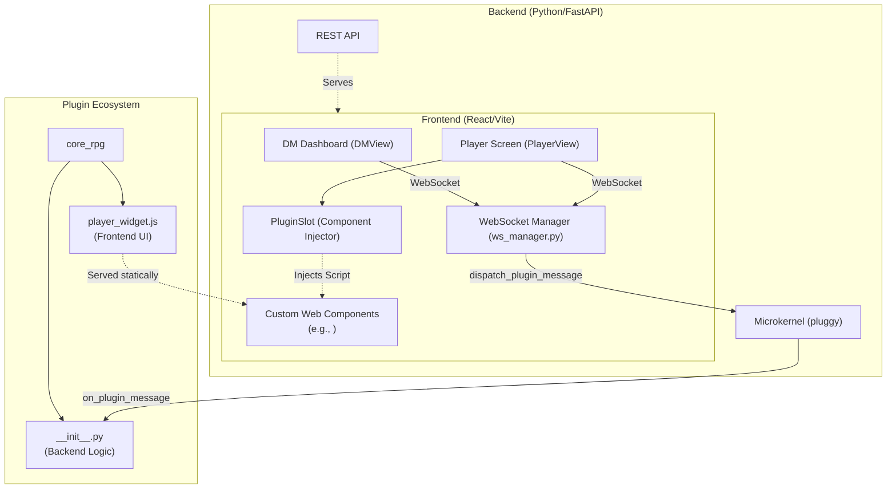
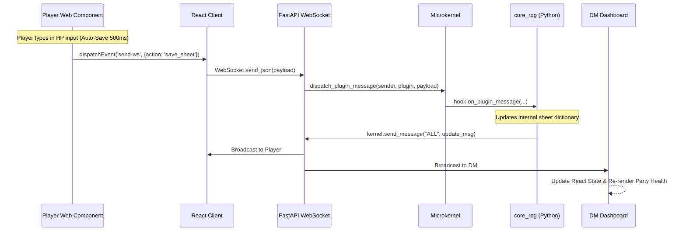

# Open VTT - Architecture Documentation

Open VTT is designed with a lightweight, modular, and plugin-centric architecture. It decouples the core networking and session management from the actual game logic, allowing developers to inject custom rulesets, character sheets, and mechanics entirely through plugins.

## High-Level Architecture

The system is split into three main layers:
1. **Frontend (React Client)**: Manages the DM and Player views, WebSocket connections, and dynamic plugin injection.
2. **Backend (Python/FastAPI)**: Manages REST endpoints, WebSockets, static file serving, and the Microkernel.
3. **Plugins**: Independent modules containing both backend logic (Python) and frontend Web Components (Vanilla JS).

## Data Flow: Modifying a Character Sheet

The following sequence diagram illustrates how data flows when a player modifies their character sheet. The entire process relies on asynchronous WebSocket communication and the Microkernel's event hooks.

## Core Components

### 1. Connection Manager (`ws_manager.py`)
Handles the lifecycle of WebSockets. It maps unique connection tokens to Player objects. When a message arrives, it identifies the `sender` by their token and maps it to their real name before passing it to the Kernel.

### 2. Microkernel (`kernel.py`)
Built on top of `pluggy`. It exposes hooks like `on_plugin_message`, `on_chat_message`, and `on_dice_roll`. The server doesn't know what games are being played; it just fires events into the kernel.

### 3. Plugin Slot (`PluginSlot.tsx`)
A React component that queries the `/api/plugins` endpoint. It dynamically downloads the `.js` files provided by the active plugins and injects them into the DOM as `<script type="module">`. Finally, it mounts the Custom Elements (Web Components) native to those plugins, fully isolating the plugin's CSS and logic from the React app.

### 4. Plugins
Plugins are completely self-contained folders inside `/plugins`. They provide:
- `__init__.py`: The Python backend that registers with the microkernel to handle state and logic.
- `*_widget.js`: Vanilla JavaScript Web Components using the Shadow DOM to render native UI within the React application without framework lock-in.
